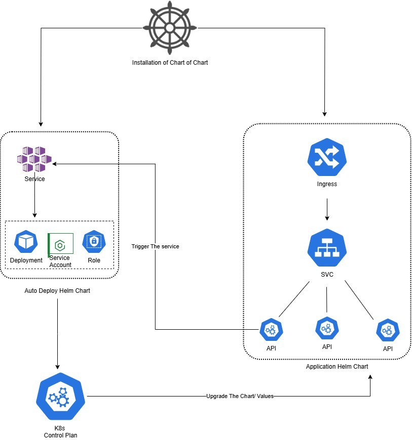
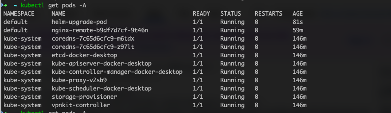
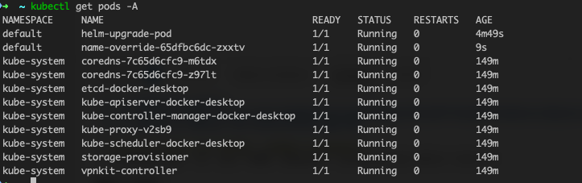

# helm-autoUpgrade



This repository provides a containerized tool to programmatically upgrade a Helm release using the Helm Go SDK. It supports custom `values.yaml` files and is suitable for automation in CI/CD pipelines.

## Features
- Upgrade any Helm release with a specified chart and values file (via URL)
- Uses the official Helm Go SDK (no shelling out)
- Ready-to-use Docker image
- GitHub Actions workflow for CI and ECR push
- Kubernetes RBAC manifest for required permissions

## Usage

### Prerequisites
- Kubernetes cluster access (with permissions to upgrade releases)
- Helm 3 compatible chart
- Docker, AWS CLI (for ECR), and kubectl (for deployment)

### Build Locally
```sh
# Clone and build
 git clone <repo-url>
 cd helm-autoUpgrade
 go mod tidy
 go build -o helm-upgrade main.go
```

### Build and Push Docker Image
```sh
docker build -t <your-ecr-repo>:<tag> .
docker push <your-ecr-repo>:<tag>
```

### Deploy in Kubernetes

1. **Deploy the Service, Pod, and RBAC**
   - Apply the `test/podAndService.yml` manifest to your Kubernetes cluster:
   ```sh
   kubectl apply -f test/podAndService.yml
   ```
   This command will install the Service, Pod, Role, and RoleBinding, attaching the necessary permissions to the default service account.

2. **Trigger a Helm Upgrade via API**
   - Once the service and pod are running, you can exec into any pod in the cluster and run the following curl command:
   ```sh
   curl -X POST http://helm-upgrade-svc:8080/upgrade \
     -H "Content-Type: application/json" \
     -d '{
       "releaseName": "nginx-remote",
       "chartURL": "https://charts.bitnami.com/bitnami/nginx-13.2.2.tgz",
       "valuesURL": "https://raw.githubusercontent.com/MayankGandhe/helm-autoUpgrade/refs/heads/main/test/new-value.yaml"
     }'
   ```
   - This will trigger a Helm upgrade . The release will be named `nginx-remote` and will use the provided chart and values file.
   - The values file can override settings such as the pod name using `nameOverride` or similar Helm values.

3. **Integration with Application Pod**
   - In a real deployment, your application pod can call this API service directly. The API will immediately acknowledge the request, allowing your application to proceed with its workflow while the upgrade runs in the background.

---

In the above example we are updating the name of the pod but we can apply any changes to the helm chart using the values.yml file , or we can update the chart version 






**Notes:**
- The API expects URLs for both the Helm chart (`chartURL`) and the values file (`valuesURL`).
- The service will handle upgrades of both Chart and Values
- Ensure the pod running this service has the necessary RBAC permissions (see `test/podAndService.yml`).
- You can customize the deployment and RBAC as needed for your environment.


**Future Enhancements**
- Mechanism to Add authentication to pull image from private helm charts.
- Should have an API call to get the current version of helm chart and image from current release.
- Create a helm char for the application that can be used in a Parent chart which will deploy the Application helm chart and this helm upgrade chart .
- Add a cronjob mechanism in the chart that can trigger itself at given frequecy and check for latest release if it's there it can trigger the update.

